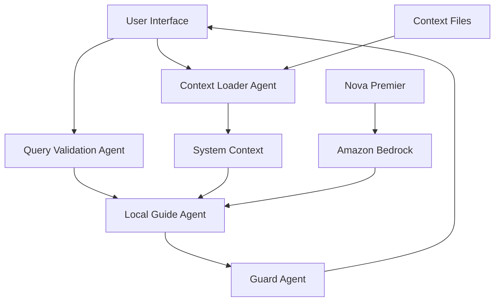

# Design Document

## Overview

The Local Guide AI application is a production-grade, minimal AI system that provides locality-aware guidance for Tamil Nadu cities (Madurai and Dindigul). The system employs a multi-agent architecture using the Strands Agents framework with Amazon Nova Premier via Bedrock to ensure context-driven responses with strict hallucination prevention.

The application follows a context supremacy principle where all responses must originate from authoritative local knowledge stored in markdown files. The system implements a four-agent architecture with clear separation of concerns: context loading, query validation, response generation, and safety validation.

## Architecture

### High-Level Architecture



### Agent Architecture

The system implements four specialized Strands agents:

1. **Context Loader Agent**: Manages city-specific context file loading
2. **Query Validation Agent**: Validates query scope and appropriateness
3. **Local Guide Agent**: Primary response generation using Nova Premier
4. **Guard Agent**: Post-processing validation to prevent hallucinations

### Technology Stack

- **Language**: Python 3.10+
- **Agent Framework**: Strands Agents SDK
- **LLM Provider**: Amazon Bedrock
- **Model**: Amazon Nova Premier (`us.amazon.nova-premier-v1:0`)
- **UI Framework**: Streamlit (primary) or CLI (alternative)
- **Context Storage**: Markdown files
- **Deployment**: Local execution

## Components and Interfaces

### Context Loader Agent

**Purpose**: Load and manage city-specific context files

**Interface**:
```python
class ContextLoaderAgent:
    def load_city_context(self, city: str) -> str
    def get_available_cities(self) -> List[str]
    def validate_city_selection(self, city: str) -> bool
```

**Responsibilities**:
- Load markdown context files based on city selection
- Validate city availability
- Provide context as system-level instructions
- Ensure context isolation between cities

### Query Validation Agent

**Purpose**: Validate user queries for scope and appropriateness

**Interface**:
```python
class QueryValidationAgent:
    def validate_query_scope(self, query: str) -> bool
    def get_rejection_reason(self, query: str) -> str
    def is_supported_topic(self, query: str) -> bool
```

**Responsibilities**:
- Check queries against supported topics (food, transport, slang, safety, lifestyle)
- Reject out-of-scope queries
- Provide appropriate rejection messaging

### Local Guide Agent

**Purpose**: Generate responses using Nova Premier with strict context adherence

**Interface**:
```python
class LocalGuideAgent:
    def generate_response(self, query: str, context: str) -> str
    def configure_model(self) -> BedrockModel
    def apply_system_prompt(self, context: str) -> str
```

**Responsibilities**:
- Generate responses using Amazon Nova Premier
- Enforce context-only responses through system prompts
- Maintain local tone with Tamil-English mix where appropriate
- Refuse when information is not available in context

### Guard Agent

**Purpose**: Post-processing validation to prevent hallucinations

**Interface**:
```python
class GuardAgent:
    def validate_response(self, response: str, context: str) -> bool
    def detect_hallucination(self, response: str, context: str) -> bool
    def force_refusal(self, reason: str) -> str
```

**Responsibilities**:
- Validate responses contain only context-based information
- Detect potential hallucinations or external knowledge
- Force standardized refusal responses when violations detected

## Data Models

### City Context Model

```python
@dataclass
class CityContext:
    city_name: str
    context_content: str
    file_path: str
    last_loaded: datetime
    
    def is_valid(self) -> bool
    def get_content_hash(self) -> str
```

### Query Model

```python
@dataclass
class Query:
    text: str
    city: str
    timestamp: datetime
    is_valid: bool
    validation_reason: Optional[str]
    
    def get_supported_topics(self) -> List[str]
```

### Response Model

```python
@dataclass
class Response:
    text: str
    is_refusal: bool
    refusal_reason: Optional[str]
    source_context: str
    validation_passed: bool
    
    def is_standardized_refusal(self) -> bool
```

### Application State Model

```python
@dataclass
class AppState:
    selected_city: Optional[str]
    loaded_context: Optional[CityContext]
    conversation_history: List[Tuple[Query, Response]]
    
    def reset_city_selection(self) -> None
    def add_interaction(self, query: Query, response: Response) -> None
```

## Correctness Properties

*A property is a characteristic or behavior that should hold true across all valid executions of a system-essentially, a formal statement about what the system should do. Properties serve as the bridge between human-readable specifications and machine-verifiable correctness guarantees.*

**Property 1: Context isolation and loading**
*For any* city selection, the Context Loader Agent should load only that city's context file and prevent any mixing of context data from other cities, and when switching cities, should completely replace the previous context
**Validates: Requirements 1.2, 1.3, 1.4**

**Property 2: Query scope validation**
*For any* user query, the Query Validation Agent should accept queries about supported topics (food, transport, slang, safety, lifestyle) and reject queries outside the supported scope with appropriate messaging
**Validates: Requirements 2.1, 2.2**

**Property 3: Context-only response generation**
*For any* valid query, the Local Guide Agent should generate responses using only information present in the loaded context file content
**Validates: Requirements 2.3**

**Property 4: Standardized refusal responses**
*For any* query where relevant information cannot be found in the context file, the Local Guide System should provide a refusal response using only one of the three specified standardized phrases
**Validates: Requirements 3.1, 3.2**

**Property 5: Guard agent validation**
*For any* generated response, the Guard Agent should validate that no information outside the context file is included and force a refusal response when hallucination or external knowledge is detected
**Validates: Requirements 3.3, 3.4**

## Error Handling

### Context Loading Errors

**File Not Found**: When a context file is missing, the system should display a clear error message and prevent city selection until the file is available.

**Malformed Context**: When a context file contains invalid markdown or is corrupted, the system should log the error and display a user-friendly message indicating the context is unavailable.

**Permission Errors**: When context files cannot be read due to permission issues, the system should provide appropriate error messaging and fallback behavior.

### Query Processing Errors

**Empty Queries**: Empty or whitespace-only queries should be rejected with appropriate user feedback.

**Extremely Long Queries**: Queries exceeding reasonable length limits should be truncated or rejected to prevent processing issues.

**Special Characters**: Queries containing special characters or encoding issues should be handled gracefully without system crashes.

### Model Integration Errors

**Bedrock Connection Failures**: When Amazon Bedrock is unavailable, the system should display a clear error message and suggest retry actions.

**Authentication Errors**: When AWS credentials are invalid or expired, the system should provide clear guidance on credential configuration.

**Rate Limiting**: When API rate limits are exceeded, the system should implement appropriate backoff strategies and user notification.

**Model Unavailability**: When Nova Premier is unavailable, the system should gracefully handle the error and inform the user.

### Guard Agent Errors

**Validation Failures**: When the Guard Agent cannot validate a response, the system should default to a refusal response for safety.

**Processing Errors**: When guard validation encounters errors, the system should log the issue and force a standardized refusal.

## Testing Strategy

### Dual Testing Approach

The Local Guide AI system requires both unit testing and property-based testing to ensure comprehensive coverage:

- **Unit tests** verify specific examples, edge cases, and error conditions
- **Property tests** verify universal properties that should hold across all inputs
- Together they provide comprehensive coverage: unit tests catch concrete bugs, property tests verify general correctness

### Unit Testing Requirements

Unit tests will cover:
- Specific examples that demonstrate correct behavior for each agent
- Integration points between agents in the processing pipeline
- Error conditions and edge cases for file loading, query validation, and response generation
- UI component behavior for both Streamlit and CLI interfaces

### Property-Based Testing Requirements

The system will use **Hypothesis** as the property-based testing library for Python. Each property-based test will:
- Run a minimum of 100 iterations to ensure thorough random testing
- Be tagged with comments explicitly referencing the correctness property from this design document
- Use the exact format: '**Feature: local-guide-ai, Property {number}: {property_text}**'
- Implement exactly one correctness property per test

**Property-Based Test Configuration:**
- Library: Hypothesis (Python)
- Minimum iterations: 100 per test
- Test tagging format: '**Feature: local-guide-ai, Property {number}: {property_text}**'
- Each correctness property must be implemented by a single property-based test

### Test Implementation Strategy

1. **Context Management Testing**: Generate random city selections and context switching scenarios to verify isolation
2. **Query Validation Testing**: Generate random queries across supported and unsupported topics to verify validation logic
3. **Response Generation Testing**: Generate random valid queries to verify context-only responses
4. **Refusal Testing**: Generate queries with missing context information to verify standardized refusal responses
5. **Guard Validation Testing**: Generate responses with and without external information to verify guard agent detection

### Integration Testing

Integration tests will verify:
- End-to-end flow from city selection through response generation
- Agent interaction patterns and data flow
- UI integration with agent backend
- Error propagation through the agent pipeline

### Performance Testing

Performance tests will verify:
- Response time requirements for typical queries
- Memory usage during context loading and switching
- Concurrent user handling capabilities
- Resource cleanup after interactions

The testing strategy ensures that both specific functionality and general system properties are thoroughly validated, providing confidence in the system's correctness and reliability.